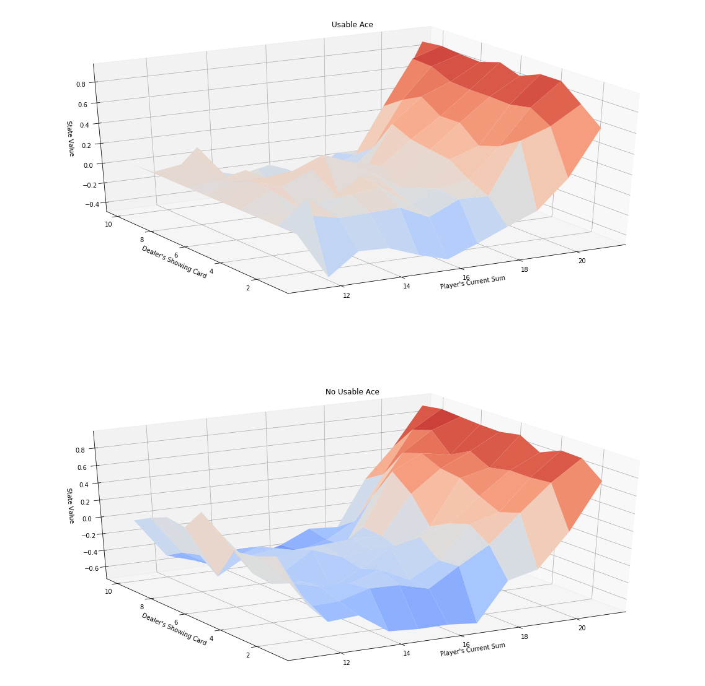
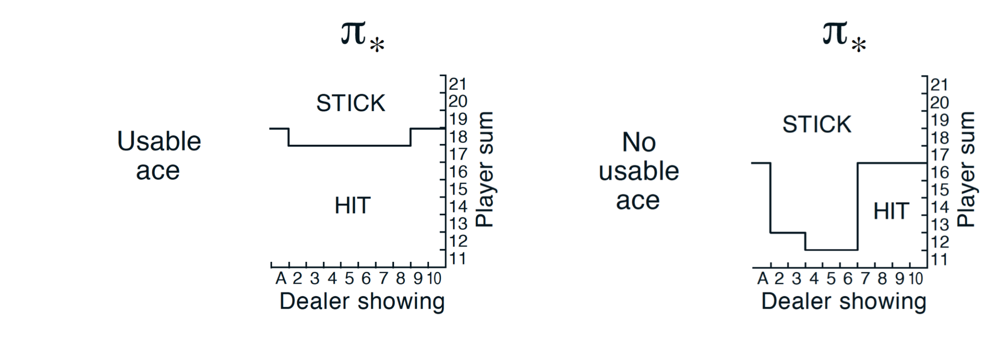
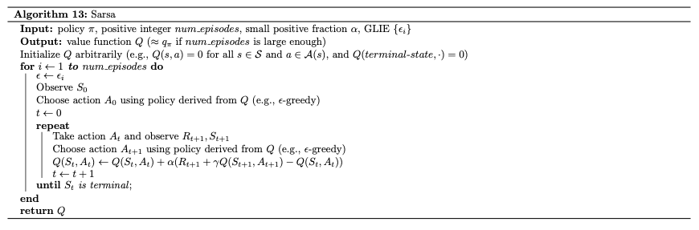
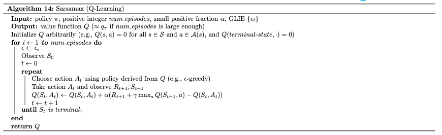
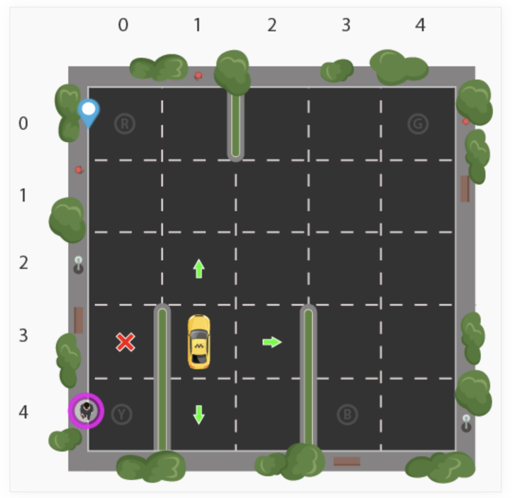

# RL-Coding
The RL algorithm 

## Blackjack
OpenAI Gym environment: https://github.com/openai/gym/blob/master/gym/envs/toy_text/blackjack.py

 - The algorithm has four arguments:

env: This is an instance of an OpenAI Gym environment.
num_episodes: This is the number of episodes that are generated through agent-environment interaction.
alpha: This is the step-size parameter for the update step.
gamma: This is the discount rate. It must be a value between 0 and 1, inclusive (default value: 1).

- The algorithm returns as output:

Q: This is a dictionary (of one-dimensional arrays) where Q[s][a] is the estimated action value corresponding to state s and action a.
policy: This is a dictionary where policy[s] returns the action that the agent chooses after observing state s.



- The true optimal policy  𝜋∗ 


## CliffWalking
OpenAI Gym environment: https://github.com/openai/gym/blob/master/gym/envs/toy_text/cliffwalking.py

The agent moves through a  4×12  gridworld, with states numbered as follows:

[[ 0,  1,  2,  3,  4,  5,  6,  7,  8,  9, 10, 11],
 [12, 13, 14, 15, 16, 17, 18, 19, 20, 21, 22, 23],
 [24, 25, 26, 27, 28, 29, 30, 31, 32, 33, 34, 35],
 [36, 37, 38, 39, 40, 41, 42, 43, 44, 45, 46, 47]]
At the start of any episode, state 36 is the initial state. State 47 is the only terminal state, and the cliff corresponds to states 37 through 46.

The agent has 4 potential actions:

UP = 0
RIGHT = 1
DOWN = 2
LEFT = 3
Thus,  S+={0,1,…,47} , and  A={0,1,2,3} . Verify this by running the code cell below.


#### sarsa


```
# get epsilon-greedy action probabilities
policy_s = epsilon_greedy_probs(env, Q[next_state], i_episode)
# pick next action A'
next_action = np.random.choice(np.arange(env.nA), p=policy_s)
# update TD estimate of Q
Q[state][action] = update_Q(Q[state][action], Q[next_state][next_action], 
                            reward, alpha, gamma)
# S <- S'
state = next_state
# A <- A'
action = next_action
```

#### Q-learning


```
# get epsilon-greedy action probabilities
policy_s = epsilon_greedy_probs(env, Q[state], i_episode)
# pick next action A
action = np.random.choice(np.arange(env.nA), p=policy_s)
# take action A, observe R, S'
next_state, reward, done, info = env.step(action)
# add reward to score
score += reward
# update Q
Q[state][action] = update_Q(Q[state][action], np.max(Q[next_state]), reward, alpha, gamma)

# S <- S'
state = next_state
```

#### Expected Sarsa


```
# pick next action
action = np.random.choice(np.arange(env.nA), p=policy_s)
# take action A, observe R, S'
next_state, reward, done, info = env.step(action)
# add reward to score
score += reward
# get epsilon-greedy action probabilities(for S')
policy_s = epsilon_greedy_probs(env, Q[next_state], i_episode, 0.005)
# update Q
Q[state][action] = update_Q(Q[state][action], np.dot(Q[next_state], policy_s), \
                           reward, alpha, gamma)

# S <- S'
state = next_state
```

- Common function

```
def update_Q(Qsa, Qsa_next, reward, alpha, gamma):
    """ updates the action-value function estimate using the most recent time step """
    return Qsa + (alpha * (reward + (gamma * Qsa_next) - Qsa))

def epsilon_greedy_probs(env, Q_s, i_episode, eps=None):
    """ obtains the action probabilities corresponding to epsilon-greedy policy """
    epsilon = 1.0 / i_episode
    if eps is not None:
        epsilon = eps
    policy_s = np.ones(env.nA) * epsilon / env.nA
    policy_s[np.argmax(Q_s)] = 1 - epsilon + (epsilon / env.nA)
    return policy_s
```
## Taxi-v2-Task
OpenAI Gym environment: https://github.com/openai/gym/blob/master/gym/envs/toy_text/taxi.py



### The Taxi Problem
from "Hierarchical Reinforcement Learning with the MAXQ Value Function Decomposition" by Tom Dietterich
 - Description:
    There are four designated locations in the grid world indicated by R(ed), G(reen), Y(ellow), and B(lue). When the episode starts, the taxi starts off at a random square and the passenger is at a random location. The taxi drives to the passenger's location, picks up the passenger, drives to the passenger's destination (another one of the four specified locations), and then drops off the passenger. Once the passenger is dropped off, the episode ends.
    Observations: 
    There are 500 discrete states since there are 25 taxi positions, 5 possible locations of the passenger (including the case when the passenger is in the taxi), and 4 destination locations. 
    
- Passenger locations:
    - 0: R(ed)
    - 1: G(reen)
    - 2: Y(ellow)
    - 3: B(lue)
    - 4: in taxi
    
- Destinations:
    - 0: R(ed)
    - 1: G(reen)
    - 2: Y(ellow)
    - 3: B(lue)
        
- Actions:
    There are 6 discrete deterministic actions:
    - 0: move south
    - 1: move north
    - 2: move east 
    - 3: move west 
    - 4: pickup passenger
    - 5: dropoff passenger
    
- Rewards: 
    There is a reward of -1 for each action and an additional reward of +20 for delivering the passenger. There is a reward of -10 for executing actions "pickup" and "dropoff" illegally.


```
$ python main.py

```
alpha = 0.27 , gamma = 0.76 , Best average reward 9.416


## Versioning

We use [SemVer](http://semver.org/) for versioning. For the versions available, see the [tags on this repository](https://github.com/your/project/tags).

## Built With

* [OpenAI Gym](https://github.com/openai/gym) - OpenAI Gym is a toolkit for developing and comparing reinforcement learning algorithms. 


## Authors

* **Tom gt** - *Fullstack egineer* - [github profile](https://github.com/tomgtbst)

## License

This project is licensed under the MIT License

## Resources

* [ Reinforcement Q-Learning from Scratch in Python with OpenAI Gym ](https://www.learndatasci.com/tutorials/reinforcement-q-learning-scratch-python-openai-gym/)

* [ Hierarchical Reinforcement Learning with the MAXQ Value Function Decomposition ](https://arxiv.org/pdf/cs/9905014.pdf)
