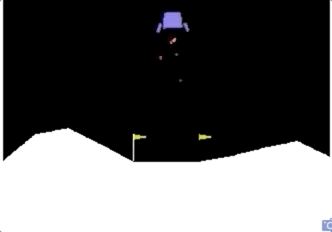
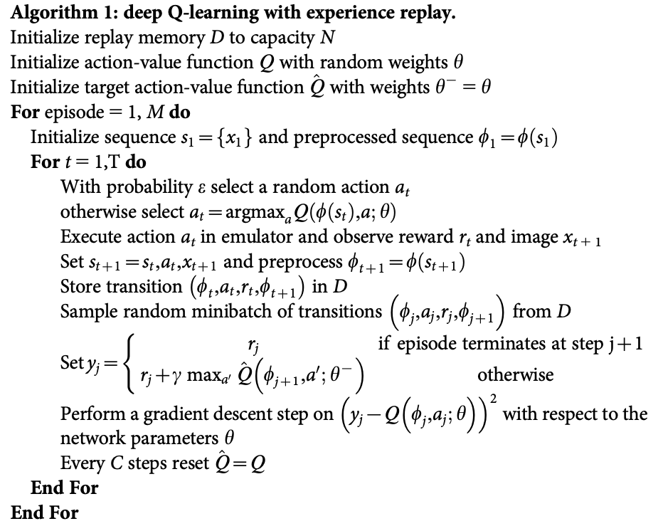

# RL_1_LunarLander-v2
A solution to solve LunarLander-v2 of OpenAI 

[Lunarlander-v2](https://gym.openai.com/envs/LunarLander-v2/) (Action Space 4, State Space 8)

 
 

## Algorithm


[Human-level control through deep reinforcement learning](https://gym.openai.com/envs/LunarLander-v2/)


### Installing

* [Anaconda](https://www.anaconda.com/products/individual) (Download anacoda toolkit)

* [OpenAI Gym](https://github.com/openai/gym) (You can perform a minimal install of gym)

```
git clone https://github.com/openai/gym.git
cd gym
pip install gym
```
* [PyTorch](https://pytorch.org/get-started/locally/) (Get started locally)
Mac
```
conda install pytorch torchvision -c pytorch
```
## Running
1. run a notebook
```
 jupyter notebook
```
2. Open "Deep_Q_Network_Solution.ipynb"

## Authors

* **Tom gt** - *Fullstack egineer* - [github profile](https://github.com/tomgtqq)


## Special Thanks
* Author wishes to thank Stackoverflow for providing great free services and to the three online resources listed below for sharing their helpful knowledge
* Udacity Blockchain ND very helpful mentors Alvaro and DanielA

## License

This project is licensed under the MIT License 
